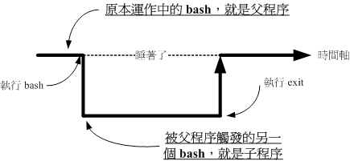

# bash

## 种类

* Bourne Shell（/usr/bin/sh或/bin/sh）
* Bourne Again Shell（/bin/bash） 是Linux 预设的shell
* C Shell（/usr/bin/csh）
* Korn Shell（/usr/bin/ksh）
* Shell for Root（/sbin/sh）
* POSIX Shell（/bin/sh）
* Z Shell（/bin/zsh）macOS 预设的shell
* ……

## 变量

### 变量名

* 变量名和等号之间不能有空格
* 变量名只能使用英文字母，数字和下划线，首个字符不能以数字开头
* 不能使用标点符号
* 不能使用bash里的关键字（可用help命令查看保留关键字）
* 不能使用空格赋值，变量名=变量值
* 变量名区分大小写
* 读取变量值时，变量名前面加美元符号$，如：$name
* 变量名外面的花括号是可选的，加不加都行，如：${name}或$name
* 变量名如果是复合形式，如：${name}1，花括号是必须的，如：${name}1

### 变量值

* 变量值可以是数字、字母、字符串、特殊字符等
* 变量值可以为空。删除变量 `unset name`
* 变量值如果是复合形式，如：$name1，变量值要用双引号括起来，如："$name"1
* 变量值如果包含空格，必须用双引号括起来，如：name="my name is tom"
* 除了让**变量不解析**使用单引号，其他情况都可以使用双引号。
* 反单引号『`指令`』或 『$(指令)』
* 追加变量内容 `PATH=${PATH}:/home/bin`
* 若该变量需要在其他子程序执行，需要以export 来使变量变成环境变量

```shell
# 变量赋值
name="tom"
# 变量引用
echo $name
# 变量删除
unset name
# 空格
name="my name is tom"
# 复合形式
home="$name at home"
home="${name} at home"
# 特殊字符
name='this is a $name' # $name 不会被解析
# 双引号
name="this is a \"name\""
# 单引号
name="this is a 'name'"
# 指令
name=`date`
name=$(date)
```

### 环境变量

> 为什么需要环境变量?</br>
> 当你登入Linux 并取得一个bash 之后，你的bash 就是一个独立的程序，这个程序的识别使用的是一个称为程序识别码，被称为PID
> 的就是。接下来你在这个bash 底下所下达的任何指令都是由这个bash 所衍生出来的，那些被下达的指令就被称为子程序了。</br>
> 我们在原本的bash 底下执行另一个bash ，结果操作的环境介面会跑到第二个bash 去(就是子程序)， 那原本的bash 就会在暂停的情况(
> 睡着了，就是sleep)。整个指令运作的环境是实线的部分！若要回到原本的bash 去， 就只有将第二个bash 结束掉(下达exit 或logout)
> 才行。</br>
> **子程序仅会继承父程序的环境变量， 子程序不会继承父程序的自订变量啦**



* 环境变量是系统中所有用户都能访问的变量
* 环境变量一般大写
* 分享自己的变量设定给后来呼叫的档案或其他程序

```shell
# 查看环境变量
env
# 查看某个环境变量
echo $PATH
# 设置环境变量
export PATH=/home/bin:$PATH
# 删除环境变量
unset PATH
# 变量导出
export PATH
```

## Exit on Error

```shell
set -e

```

## Trap Signals

```shell
trap 'echo "Error occurred"; cleanup; exit 1' ERR

function cleanup() {
  # Cleanup code
  echo "Cleaning up"
}

```

## Logging

```shell
logfile="script.log"
exec > >(tee -i $logfile)
exec 2>&1

echo "Script started"

```
