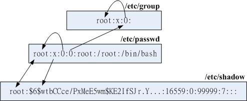

# user and group

## uid and gid

> 一个是使用者 ID (User ID ，简称UID)、一个是群组ID (Group ID ，简称GID)。

```shell
# id  
id liubin
# uid=501(liubin) gid=20(staff) groups=20(staff),12(everyone),61(localaccounts),79(_appserverusr),80(admin),81(_appserveradm),98(_lpadmin),701(com.apple.sharepoint.group.1),33(_appstore),100(_lpoperator),204(_developer),250(_analyticsusers),395(com.apple.access_ftp),398(com.apple.access_screensharing),399(com.apple.access_ssh),400(com.apple.access_remote_ae)
# 用户属于多个组
```

## /etc/passwd

> /etc/passwd 文件是一个重要的文件，它存放了所有的使用者账号的相关信息，包括使用者的 UID、GID、家目录、shell 程式等等。<br>
> 该文件的格式为：用户名:密码:UID:GID:用户信息:家目录:shell <br>
> 不过需要特别留意的是，里头很多账号本来就是系统正常运作所必须要的，我们可以简称他为系统账号， 例如bin, daemon, adm, nobody
> 等等，这些账号请不要随意的杀掉他呢！

```shell
# /etc/passwd
# root:x:0:0:root:/var/root:/bin/bash
# 用户名:密码:UID:GID:用户信息:家目录:shell
```

## /etc/shadow

> /etc/shadow
>
文件是一个重要的文件，它存放了所有的使用者账号的密码信息，包括使用者的密码、密码的有效期、密码的最小天数、密码的最大天数、密码的警告天数、密码的失效天数、密码的失效日期等等。<br>
> 该文件的格式为：用户名:密码:最后一次修改密码的日期:密码的最小天数:密码的最大天数:密码的警告天数:密码的失效天数:
> 密码的失效日期:保留<br>

```shell
# /etc/shadow
# root:*:17600:0:99999:7:::
# 用户名:密码:最后一次修改密码的日期:密码的最小天数:密码的最大天数:密码的警告天数:密码的失效天数:密码的失效日期:保留
```

## /etc/group

> /etc/group 文件是一个重要的文件，它存放了所有的群组账号的相关信息，包括群组的 GID、群组的使用者等等。<br>
> 该文件的格式为：群组名:密码:GID:群组使用者<br>

```shell
# /etc/group
# root:*:0:
# wheel:*:0:root,dmtsai,alex
```

## 关系



## group

### 有效群组(effective group)与初始群组(initial group)

> 有效群组 (Effective Group ID)：是指用户目前所属的群组，这个群组是由用户的登录 shell
> 所设定的，而不是由用户的账号所设定的。<br>
> 初始群组 (Initial Group ID)：是指用户账号所属的群组，这个群组是由用户的账号所设定的，而不是由用户的登录 shell
> 所设定的。<br>

```shell
groups
# dmtsai wheel users
# 第一个输出的群组即为有效群组(effective group) 了
newgrp users
# newgrp: only for login shell
# 有效群组只能在登录shell中设置
```

### groupadd groupdel groupmod

```shell
groupadd users
# 创建群组
groupdel users
# 删除群组
groupmod -n users wheel
# 修改群组名
# -n 新群组名
```

## user

### useradd userdel usermod passwd

```shell
useradd -m -g users -G wheel -s /bin/bash dmtsai
# -m 创建用户的同时，创建用户的家目录
# -g 指定用户的初始群组
# -G 指定用户的附加群组
# -s 指定用户的登录 shell
# dmtsai 用户名
userdel -r dmtsai
# -r 删除用户的同时，删除用户的家目录
usermod -g users -G wheel -s /bin/bash dmtsai
# -a 附加群组
# 修改用户密码
passwd dmtsai
# 要求用户修改密码
chage -d 0 agetest 
# 追加群组
usermod -aG wheel dmtsai
```

## su and sudo

### su

```shell
su - dmtsai
# - 切换到dmtsai用户
# -l 切换到dmtsai用户并加载用户的环境变量 等于 -
# -c 执行命令
su -c "ls -l" dmtsai
```

### sudo

```shell
sudo -u dmtsai ls -l
# -u 切换到dmtsai用户
sudo -u dmtsai -s
# -s 切换到dmtsai用户并加载用户的环境变量
sudo -u dmtsai -s -c "ls -l"
# -c 执行命令
# sudo 没有u参数默认切换到root用户
```

#### sudo 权限

- `visudo` 编辑sudo配置文件

```shell
# /etc/sudoers
# root 用户可以执行所有命令
# root ALL=(ALL) ALL
# wheel group 都可以执行所有命令
# %wheel ALL=(ALL) ALL
# 不需要密码
# %wheel ALL=(ALL) NOPASSWD: ALL
```
