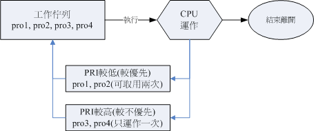

# 进程

## ps

```shell
# 显示所有进程
ps aux
# 查看nginx进程
ps -ef \
  | grep nginx
```

### `ps aux` 返回值

* USER：进程所有者
* PID：进程ID
* TTY：终端类型
* STAT：进程状态
  * D：不可中断的睡眠状态
  * R：运行
  * S：睡眠
  * T：跟踪/停止
* START：进程启动时间
* TIME：占用CPU时间总计
* COMMAND：启动程序命令名
* %MEM：进程使用的物理内存百分比
* %CPU：进程使用的CPU百分比
* VSZ：进程使用的虚拟内存总量，单位kb
* RSS：进程使用的、未被换出的物理内存大小，单位kb

## 后台执行

### 后台运行

```shell
# 复制文件
# 放入背景的工作是不可以使用[ctrl]+c 来终止的 
cp /etc/passwd /tmp/passwd &
# [1] 4404 [job number] pid
# [1]+  Done                    cp /etc/passwd /tmp/passwd

# 输出重定向 
cp /etc/passwd /tmp/passwd >/tmp/cp.log 2>&1 &
```

### 后台暂停

```shell
# 暂停
# [ctrl]+z
# [1]  - suspended  vim main.py
# [2]  + suspended  vim Dockerfile
# 那个+ 代表最近一个被丢进背景的工作
```

### jobs

```shell
# 查看后台任务
jobs
# [1]  - suspended  vim main.py
# [2]  + suspended  vim Dockerfile
# -l 详细信息
# -p 只显示pid
```

### fg

```shell
# 将后台任务放入前台
fg %1
```

### bg

```shell
# 将后台任务开始
# 那个[ctrl]-z 可以将目前的工作丢到背景底下去『暂停』， 那么如何让一个工作在背景底下『 Run 』呢？这时候就要用到bg 了！
bg %1
```

### nohup

```shell
# & 的方式放到背景, 会因为终端关闭而关闭。
# nohup 的方式放到背景, 不会因为终端关闭而关闭。
nohup ./sleep500.sh &
# [1] 5276  [job number] pid
# nohup: ignoring input and appending output to 'nohup.out'
# 讯息的输出就会被导向『 ~/nohup.out 』这个档案中去！
nohup java -jar /home/liubin/soft/jenkins.jar >/home/liubin/soft/jenkins.log 2>&1 &
```

## kill

```shell
# 杀死进程
kill -9 1234
# kill -signal pid|%job
  # -2 ：代表与由键盘输入[ctrl]-c 同样的动作；
  # -9 ：立刻强制删除一个工作；
  # -15：以正常的程序方式终止一项工作。与-9 是不一样的。
# 少用-9  
```

## nice

* nice 值可调整的范围为-20 ~ 19 ；
* root 可随意调整自己或他人程序的Nice 值，且范围为-20 ~ 19 ；
* 一般使用者仅可调整自己程序的Nice 值，且范围仅为0 ~ 19 (避免一般用户抢占系统资源)；
* 一般使用者仅可将nice 值越调越高，例如本来nice 为5 ，则未来仅能调整到大于5；



```shell
# nice [-n 数字] command
nice -n 10 sleep 500
# renice [number] PID
renice 10 1234
```

## proc

### 总文件夹

> 我们之前提到的所谓的程序都是在记忆体当中嘛！而记忆体当中的资料又都是写入到 /proc/* 这个目录下的，所以啰，我们当然可以直接观察/proc
> 这个目录当中的档案啊！

| 档名                | 档案内容                                         |
|-------------------|----------------------------------------------|
| /proc/cmdline     | 载入kernel 时所下达的相关指令与参数！查阅此档案，可了解指令是如何启动的！     |
| /proc/cpuinfo     | 本机的CPU 的相关资讯，包含时脉、类型与运算功能等                   |
| /proc/devices     | 这个档案记录了系统各个主要装置的主要装置代号，与 mknod有关呢！           |
| /proc/filesystems | 目前系统已经载入的档案系统啰！                              |
| /proc/interrupts  | 目前系统上面的IRQ 分配状态。                             |
| /proc/ioports     | 目前系统上面各个装置所配置的I/O 位址。                        |
| /proc/kcore       | 这个就是记忆体的大小啦！好大对吧！但是不要读他啦！                    |
| /proc/loadavg     | 还记得top以及uptime 吧？没错！上头的三个平均数值就是记录在此！         |
| /proc/meminfo     | 使用free列出的记忆体资讯，嘿嘿！在这里也能够查阅到！                 |
| /proc/modules     | 目前我们的Linux 已经载入的模组列表，也可以想成是驱动程式啦！            |
| /proc/mounts      | 系统已经挂载的资料，就是用mount 这个指令呼叫出来的资料啦！             |
| /proc/swaps       | 到底系统挂载入的记忆体在哪里？呵呵！使用掉的partition 就记录在此啦！      |
| /proc/partitions  | 使用fdisk -l 会出现目前所有的partition 吧？在这个档案当中也有纪录喔！ |
| /proc/uptime      | 就是用uptime 的时候，会出现的资讯啦！                       |
| /proc/version     | 核心的版本，就是用uname -a 显示的内容啦！                    |
| /proc/bus/*       | 一些汇流排的装置，还有USB 的装置也记录在此喔！                    |

### /proc/[pid]

| 文件名     | 文件内容          |
|---------|---------------|
| cmdline | 包含进程的完整命令行信息。 |
| comm    | 包含进程的命令名      |
| environ | 进程的环境变量       |
| limits  | 当前进程的资源限制     |

